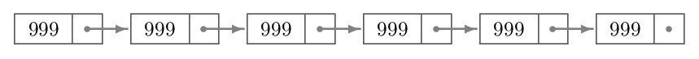

# Listas Encadeadas em Python

## O que é uma lista encadeada?

Lista encadeada trata-se de uma estrutura onde dentro de um objeto quando existir proximo ele estará adicionado neste objeto, exemplo:


Neste exemplo, temos uma lista encadeada onde o primeiro objeto sempre aponta para o proximo objeto, caso possua algum
valor. O ultimo objeto sempre aponta para nulo, pois não possui proximo objeto.

## Como funciona o código desenvolvido?

Nas primeiras linhas do código Main, fazemos a instância de uma classe chamada NodeList()
ela será responsável por gerenciar toda a nossa lista encadeada.

```python
lista_simples = NodeList()
```

Dentro do NodeList, temos métodos para inserir, buscar e adicionar ao final.

```python
# pegar específico
lista_simples.get(2)

# inserir no index informado
lista_simples.insert(0, 1000)

# inserir no final
lista_simples.append(10)

# tamanho da total da lista
lista_simples.length()
```

####  Para mais informações de como funciona, o código está documentando o fluxo de cada função.